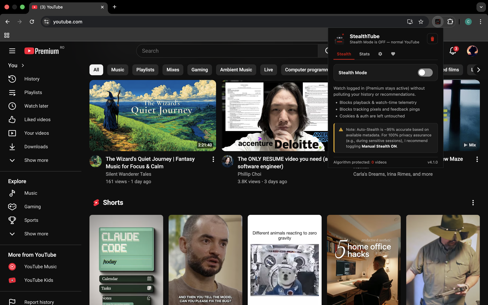
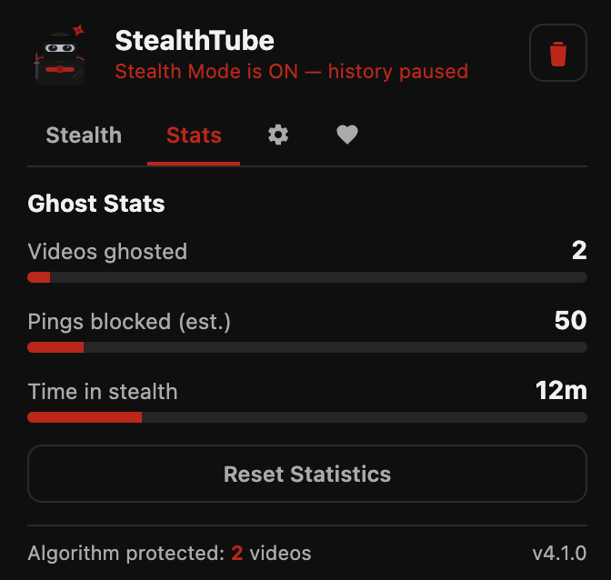
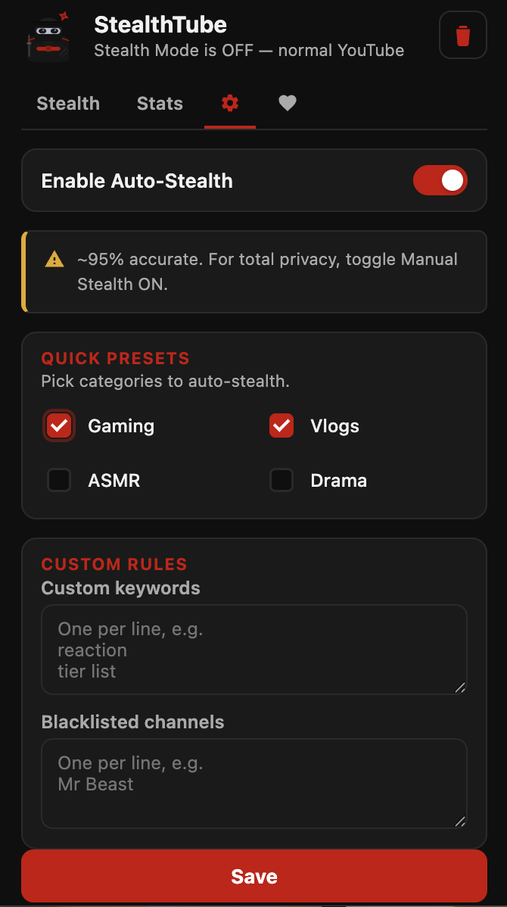
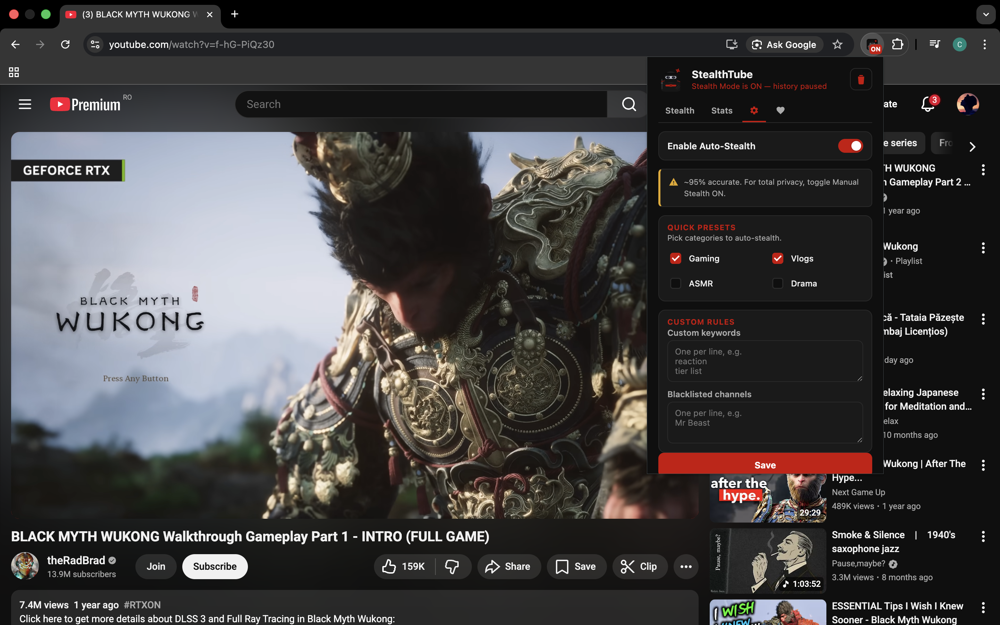
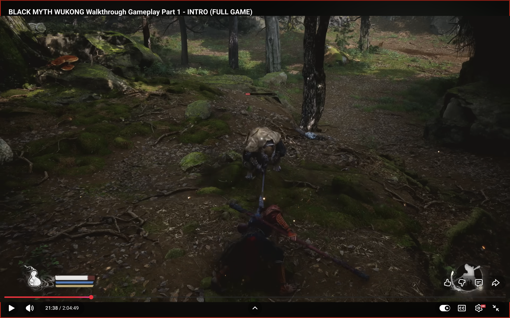

# StealthTube 🥷

**Reclaim your YouTube focus.**

[](https://chromewebstore.google.com/detail/dlonngfflmflglgfgooiidejppeijcpee)
[](LICENSE)

Watch YouTube logged in — keep your Premium benefits (no ads, background play) — without polluting your watch history or recommendations. StealthTube intercepts tracking telemetry at the network level so YouTube never learns what you watched in stealth mode.

---

## 📸 Screenshots

| 🏠 Home Interface | 📊 Privacy Stats | ⚙️ Custom Rules |
|---|---|---|
|  |  |  |

| 🔴 Stealth Active Mode | 🖥️ Full Screen Experience |
|---|---|
|  |  |

---

## Key Features

### Iron Curtain (Static Blocking)
A block-by-default static ruleset enabled from the manifest. It blocks playback, watch-time, and ptracking pings **before any JavaScript runs** -- zero race window on page load. The curtain is only lowered when the content script sends a definitive `SAFE_VERDICT`.

### Session ID Poisoning (Dynamic Blocking)
When a video is flagged as toxic, StealthTube creates permanent dynamic `declarativeNetRequest` rules that block all tracking pings containing that specific video ID. These rules persist even if the static ruleset cycles on and off during the browser session.

### Auto-Stealth (Metadata & URL Scanning)
Automatically activates stealth mode based on video metadata -- title, description, hidden tags, category, and URL parameters. Uses a multi-pass detection timeline:
- **Immediate** -- URL params (`ab_channel`) and DOM metadata
- **Fast** (500 ms) -- Full DOM scan, authoritative for safe verdict
- **Thorough** (1.5 s) -- Hidden tags from `ytInitialPlayerResponse`, final authority

### Channel Blacklist
Add channel names to the blacklist for 100% reliable auto-stealth on specific creators. Also detects channel page visits via URL handle (`@handle`, `/c/`, `/user/`).

### Quick Presets
One-click category filters -- Gaming, Vlogs, ASMR, Drama -- with case-insensitive, punctuation-ignoring matching (so "D.r.a.m.a" still trips the Drama preset).

### Privacy Stats
Track videos ghosted, estimated pings blocked (25 per toxic video), and time spent in stealth. "One Video = One Count" deduplication ensures accurate statistics.

### Panic Button
Instantly wipe the last watched video from your YouTube watch history with one click.

---

## Installation

### Build Once (Required)

This repo now builds browser-specific extension folders:

```bash
node build.js
```

Build output:
- `dist/chrome` -- load this in Chromium browsers
- `dist/firefox` -- load this in Firefox

### Chrome / Edge / Brave (Chromium)

1. Download or clone this repository:
   ```
   git clone https://github.com/costin-cernea/youtube-stealth-mode-extension.git
   ```
2. Build the browser-specific package:
   ```
   node build.js
   ```
3. Open your browser and navigate to `chrome://extensions` (or `edge://extensions`)
4. Enable **Developer mode** (toggle in the top-right corner)
5. Click **Load unpacked**
6. Select the `dist/chrome` folder
7. Pin the StealthTube icon in your toolbar, click it, and flip the switch

### Firefox

1. Download or clone this repository
2. Build the browser-specific package:
   ```
   node build.js
   ```
3. Open Firefox and navigate to `about:debugging#/runtime/this-firefox`
4. Click **Load Temporary Add-on**
5. Select `dist/firefox/manifest.json`

> **Note:** Firefox Manifest V3 is supported on Firefox 115+. The `browser_specific_settings.gecko` block provides the required add-on ID. For permanent installation, sign and package with [web-ext](https://github.com/mozilla/web-ext).

---

## Public Repo Checklist

Before publishing this repo publicly, verify these basics:

- Confirm the project name and description are clear for first-time visitors
- Ensure screenshots/GIFs are up to date (if you add them)
- Keep setup steps copy-paste friendly (`git clone`, `node build.js`, load from `dist/...`)
- Double-check all links (support, docs, license)
- Verify no secrets/tokens are committed (none are required for this project)
- Keep `dist/` out of git (generated artifacts should not be versioned)

---

## Verifying It Works

1. Turn Stealth Mode **ON**
2. Open YouTube, start a video, and open DevTools -> **Network** -> filter `stats/`. Requests to `playback`, `watchtime`, etc. should appear with status **(blocked)**
3. Open [youtube.com/feed/history](https://www.youtube.com/feed/history) -- videos watched while Stealth Mode was ON should not appear
4. Confirm Premium is still active (no ads, background play works)

---

## How It Works

StealthTube uses a **dual-state model**:

| State | Purpose |
| --- | --- |
| **Manual State** | Your popup toggle -- persists across sessions |
| **Current State** | What is actually active -- may differ during auto-stealth |

When stealth is active, the extension:
- Blocks playback and watch-time telemetry pings
- Blocks tracking pixels and feedback pings
- Leaves cookies and authentication untouched (Premium stays active)
- Shows a "STEALTH ACTIVE" badge and red player border

When auto-stealth detects a match, it engages automatically. Navigating away from the video reverts to your manual state.

### Architecture

| Layer | Role |
| --- | --- |
| `background.js` | Service worker. Owns state, manages `declarativeNetRequest` rulesets, Iron Curtain lifecycle, Session ID Poisoning, and the message router |
| `rules_curtain.json` | Static Iron Curtain ruleset (enabled by default) |
| `rules.json` | Full stealth ruleset (toggled by manual switch or auto-stealth) |
| `content.js` | Reads video metadata, runs blacklist matching, sends verdicts to background, manages visual indicators |
| `config.js` | All YouTube DOM selectors in one place -- update here when YouTube ships layout changes |
| `popup.html/js/css` | Toggle UI, stats dashboard, settings panel, about section |
| `browser-polyfill.js` | Tiny shim aliasing `chrome` to `browser` for cross-browser compatibility |

### Endpoints Blocked

- `*://youtube.com/api/stats/playback*` -- playback telemetry
- `*://youtube.com/api/stats/watchtime*` -- watch-time tracking
- `*://youtube.com/api/stats/qoe*` -- quality of experience
- `*://youtube.com/api/stats/atr*` -- ad tracking
- `*://youtube.com/youtubei/v1/log_event*` -- event logging
- `*://youtube.com/youtubei/v1/feedback*` -- feedback pings
- `*://youtube.com/youtubei/v1/attestation*` -- attestation
- `*://youtube.com/ptracking*` -- player tracking
- `*://youtube.com/csi_204*` -- client-side instrumentation
- `*://s.youtube.com/*` -- tracking pixel domain

---

## Privacy

All processing happens **locally in your browser**. StealthTube:
- Does **not** collect or transmit any user data
- Does **not** communicate with any external server
- Stores only your settings, toggle state, and anonymous statistics in `chrome.storage.local`
- Is fully open-source -- inspect every line of code

---

## Support

If StealthTube helped you reclaim your focus, consider supporting the project:

- [Buy Me a Coffee](https://www.buymeacoffee.com)
- Star this repository on GitHub

---

## License

GPLv3
